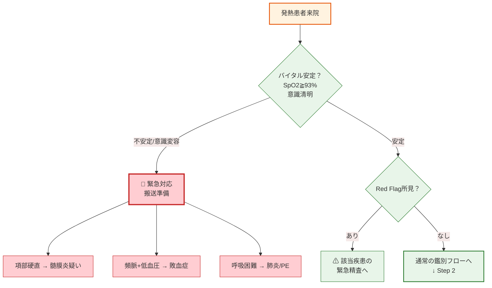
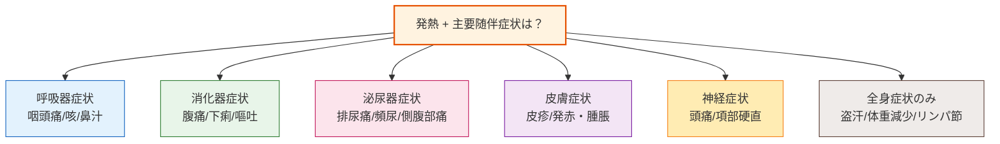
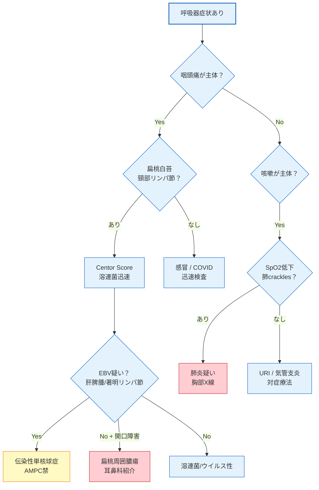
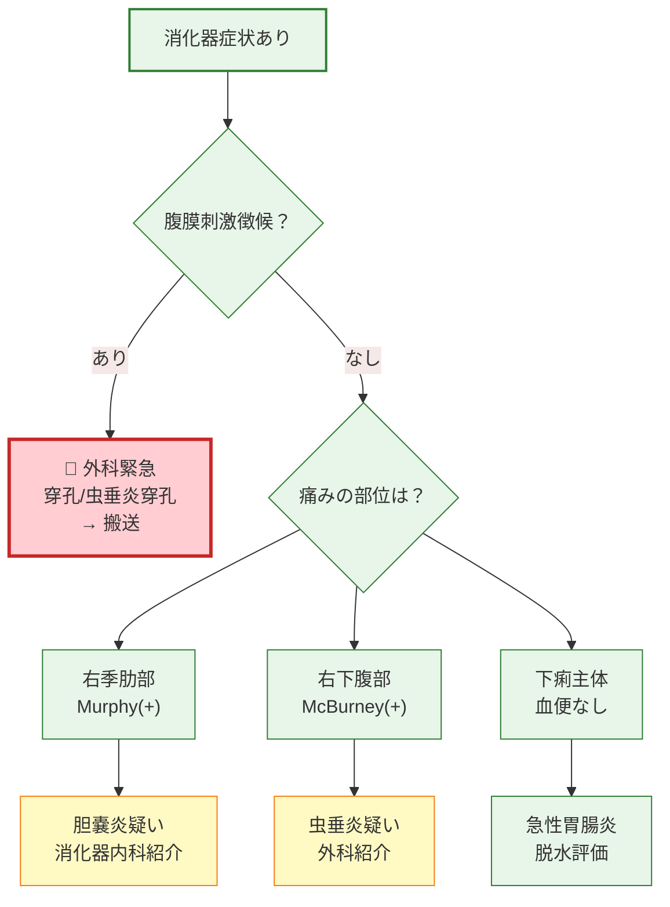
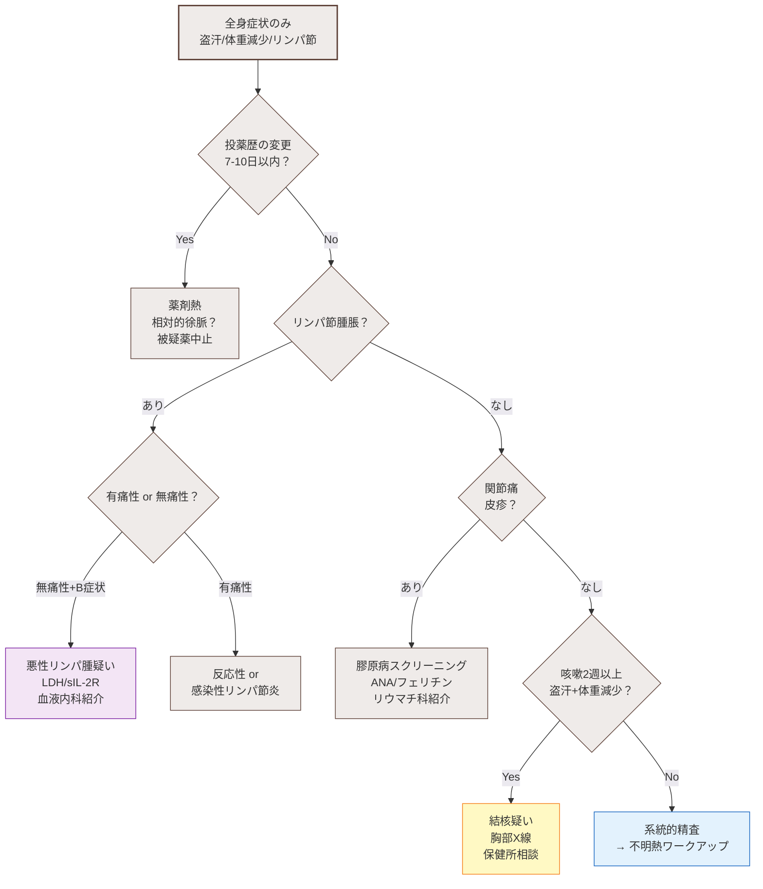

# 発熱 — Diagnostic Booster (Prototype)

:::caution[プロトタイプ]
本ページはテスト用です。実用に耐えると判断された場合、既存の発熱精査ページと入れ替えます。
:::

---

## インタラクティブ鑑別ツール

症状をポチポチ選択していくと、鑑別候補がリアルタイムに絞り込まれます。

<DiagnosticBooster />

---

## 診断フローチャート

### Step 1: 緊急性の判断

### Step 2: 主要随伴症状による分岐

### Step 2a: 呼吸器系の鑑別

### Step 2b: 消化器系の鑑別

### Step 2c: 全身症状・長期発熱の鑑別

---

## 使い方

1. **Phase 1**: 発熱に伴う随伴症状をポチポチ選択する
2. **Phase 2**: 選択した症状に応じて表示される身体所見を選択する
3. **Phase 3**: 鑑別候補が一致度順に表示される。各候補には次のアクション提案、追加確認すべき所見が表示される

Red Flag所見が選択されると、画面上部に即座に警告が表示されます。

---

:::info[今後の拡張予定]
- 他の主訴（腹痛・頭痛・胸痛・めまい等）への展開
- バイタルサイン入力Phase（SpO2・体温・心拍数）の追加
- 検査結果入力によるさらなる絞り込み
:::
